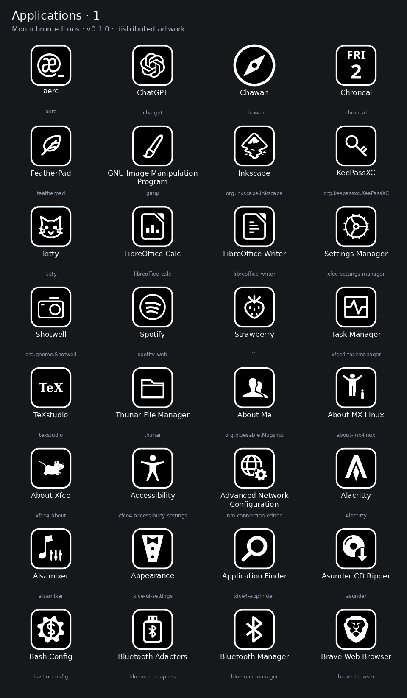

# Monochrome Icons

White drawings on black faces, with a consistent rounded-square outline. Made for a dark Xfce desktop and Plank, while keeping applications recognizable.



## v0.1.0

205 reviewed SVG catalog entries: 145 application/dock entries, 16 menu/panel entries, 6 session actions and 38 weather conditions. The optional Xfce Weather companion contains 114 PNGs at 22, 48 and 128 pixels. Counts include purposeful aliases, not 205 unique drawings.

This is a **WhiteSur-compatible icon-theme overlay**, not a GTK or window-manager theme. It inherits `WhiteSur-dark,hicolor`; icons outside its coverage fall back to those themes. Install WhiteSur-dark separately for the intended fallback appearance. The existing pink/dark GTK styling is independent and is not changed by this package.

Some assets could not yet be verified for redistribution: [36 entries are omitted](OMITTED.md), including Brave Origin. The regular WhiteSur-derived Brave Browser icon is included. Omitted artwork is not in the repository or previews; nothing has been removed from the original desktop installation.

## Previews

The pictures show only the distributed artwork, not private desktop screenshots.

- [Applications 1](previews/applications-01.png) · [2](previews/applications-02.png) · [3](previews/applications-03.png) · [4](previews/applications-04.png) · [5](previews/applications-05.png)
- [Menu and session icons](previews/menu-session.png)
- [Weather conditions](previews/weather.png)

## Install

Requires Python 3.9+ on Linux. Xfce activation also requires `xfconf-query` and an active Xfce session. Rendering previews is optional and has separate dependencies below. No administrator privileges are needed.

Download and extract the release, or clone this repository:

```sh
git clone https://github.com/antoinebaudrimont-beep/monochrome-icons.git
cd monochrome-icons
python3 tools/check_release.py
python3 tools/install_theme.py install --dry-run
python3 tools/install_theme.py install
```

Then choose **Monochrome Icons** in **Xfce Settings → Appearance → Icons**. Alternatively use `install --activate` instead of the final command to select it automatically. Installing without `--activate` changes no session settings.

The checked-in `theme/MonochromeIcons` is ready to install. Rebuild it from the editable SVG sources with:

```sh
python3 tools/build_theme.py --cleared-only
```

### Application and menu overrides

Many native launchers use shared or absolute icon paths. Selecting a theme cannot override an absolute `Icon=` path. To map supported installed applications and menu categories to their distinct names, opt in on the initial install:

```sh
python3 tools/install_theme.py install --known-apps --menu --activate --dry-run
python3 tools/install_theme.py install --known-apps --menu --activate
```

The installer copies matching launchers/categories into per-user XDG directories and modifies only their main `Icon` fields. `Exec`, URL arguments, default-browser associations, desktop actions and Plank layout are preserved. Missing applications are skipped. Existing overrides are backed up. It never restarts Plank or the panel.

Profile-specific web apps and dynamic calendar launchers are deliberately excluded from automatic mapping. To map one of your own launchers explicitly, add e.g. `--map my-browser.desktop=chawan` on the initial install. The application must already be installed; this package does not create launcher commands. Available keys and supported portable desktop IDs are in [assets.json](assets.json).

The Applications grid has the `gnome-applications` and `applications-other` aliases. For a custom Whisker menu button, choose the `monochrome-menu-mx-menu-button` icon in its preferences; button settings are not changed automatically. Dock launchers with hardcoded icon paths likewise need an explicit mapping or a manual icon selection.

**Calendar examples are static in v0.1.0.** No calendar timer/helper or existing daily-updating icon is changed. Portable dynamic-calendar integration is deferred; do not point a date-writing helper at managed theme files, because restore detects subsequent edits.

### Xfce Weather companion

The Weather plugin uses a separate icon directory, not the desktop icon theme. On the initial install, add `--weather`:

```sh
python3 tools/install_theme.py install --weather --dry-run
python3 tools/install_theme.py install --weather
```

Then choose **Monochrome Weather** in **Weather Preferences → Appearance**. Forecast location, units and other settings are not changed. If a `monochrome` Weather directory already exists, the installer refuses to overwrite it. The companion is optional.

All options can be combined on a single initial install. The installer refuses to replace an existing `MonochromeIcons` directory; restore a prior managed installation before reinstalling/updating. If there is a manually installed theme with that name, move it aside yourself first after keeping a backup.

## Restore

Installation prints the path to its private backup `manifest.json`. Keep that path. Run:

```sh
python3 tools/install_theme.py restore /absolute/path/to/manifest.json --dry-run
python3 tools/install_theme.py restore /absolute/path/to/manifest.json
```

If you selected a Weather companion manually, first select your previous Weather icon set. If you selected the desktop icon theme manually, first choose your previous desktop icon theme. An activation performed with `--activate` is restored automatically.

Restore checks **every managed file before changing anything**. If an icon/launcher has been edited, a backup is missing, or an automatically activated theme has since changed, restore stops for review. Existing launchers are restored byte-for-byte with their prior permissions; only unchanged files created by the installer are deleted. Extra user files and backups are retained. There is no force-delete option. An interrupted install may require reviewing its retained manifest rather than forcing a restore.

## Validation and development

```sh
python3 tools/check_release.py
python3 tools/test_install.py
```

Tests use temporary homes and do not activate or write to your desktop. The checker verifies catalog/package checksums, safe SVG content, alias identity, all Weather sizes, review gates and absence of private machine paths/launcher files. It is an integrity gate, not a guarantee that every future asset is licensed correctly.

To regenerate the clean preview sheets, install Python Pillow and PyGObject with the GdkPixbuf/librsvg SVG loader (on Debian: `python3-pil python3-gi gir1.2-gdkpixbuf-2.0 librsvg2-common`), then run:

```sh
python3 tools/make_previews.py
python3 tools/check_release.py
```

## License and credits

Original project artwork, frames and code: **GPL-3.0-only**. Upstream attribution and license notices remain applicable. In particular, Robin Jarry's original **aerc mark is CC BY 4.0**, not relicensed as our own artwork. WhiteSur, Foliate and MX credits and source evidence are documented in [ATTRIBUTION.md](ATTRIBUTION.md), [per-asset credits](notices/ASSET-CREDITS.md) and [assets.json](assets.json). Full license texts are included.

Application names and marks identify their respective applications. Copyright licensing does not grant trademark rights or imply endorsement. This project is not affiliated with the applications it depicts.

Further coverage and portable integrations: [ROADMAP.md](ROADMAP.md).
